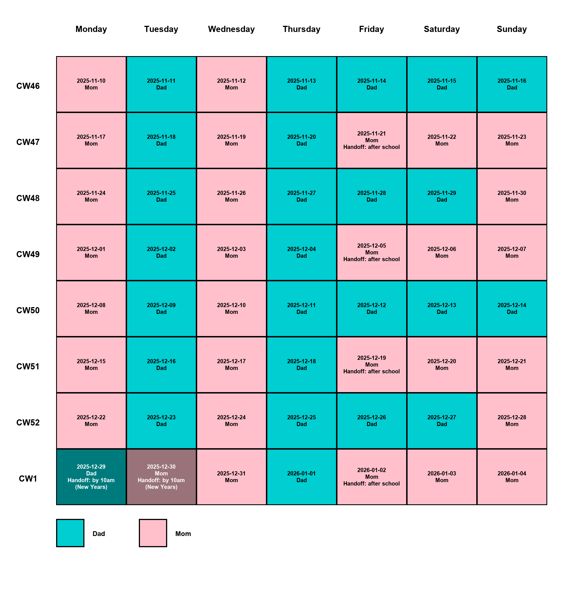

# family-schedulekit

A reusable, machine-readable schema for defining **family custody / parenting schedules**.
Designed to be **AI-friendly** (JSON rules + examples) so you can generate clear messages, calendar entries, or visualizations for any given date.

---

## 🎯 Purpose

This project provides:

- A **neutral schema** for defining parenting time schedules.
- A **JSON template** for rules (weekdays, weekends, holidays, exceptions).
- **Worked examples** (with ISO 8601 calendar week rotation).
- Clear **handoff logic** for school days and special Sunday rules.

You can reuse this schema for any co-parenting arrangement by changing the `parties` and `rules`.

---

## 📸 Example Output

Here's what a 8-week schedule visualization looks like:



The calendar color-codes each day by guardian (hot pink for Mom, midnight blue for Dad), making it easy to see custody patterns at a glance. You can export schedules in multiple formats (JSON, PNG) and customize colors to match your preferences.

---

## 📖 Rules Summary

- **Schedule Structure**
  - Schedules are organized by **odd weeks** and **even weeks**
  - Each week (odd or even) defines custody for all 7 days
  - Any day can use simple guardian assignment or complex modulo rules

- **Example Schedule**
  - **Odd ISO weeks (CW1, CW3, CW5, …):**
    - Monday-Thursday → Guardian 1
    - Friday-Sunday → Guardian 1
  - **Even ISO weeks (CW2, CW4, CW6, …):**
    - Monday → Guardian 2
    - Tuesday → Guardian 1
    - Wednesday → Guardian 2
    - Thursday → Guardian 1
    - Friday-Saturday → Guardian 2
    - Sunday uses **modulo rules** based on calendar week number:
      - If `CW % 4 == 0`: Guardian 2 has Sunday
      - Otherwise: Guardian 1 has Sunday

- **Handoffs**
  - Default handoff location applies whenever custody changes between guardians
  - **Special handoffs** can be configured for any weekday with specific times and guardians
  - Example: Sunday **Guardian 2 → Guardian 1 by 1 PM** when Guardian 2 has custody

- **Calendar Week System**
  - Uses **ISO 8601 week numbering** (CW1 begins on the Monday containing the first Thursday of the year)

---

## 📦 JSON Template

```json
{
  "parties": {
    "guardian_1": "Dee Fault",
    "guardian_2": "Nora Mal",
    "children": ["Buggy", "Piplet"]
  },
  "calendar_week_system": "ISO8601",
  "handoff": {
    "default_location": "school",
    "special_handoffs": {
      "sunday": {
        "from_guardian": "guardian_2",
        "to_guardian": "guardian_1",
        "time": {
          "hour": 13,
          "minute": 0,
          "by": true
        },
        "description": "guardian_2_to_guardian_1_by_1pm"
      }
    }
  },
  "rules": {
    "odd_weeks": {
      "monday": "guardian_1",
      "tuesday": "guardian_1",
      "wednesday": "guardian_1",
      "thursday": "guardian_1",
      "friday": "guardian_1",
      "saturday": "guardian_1",
      "sunday": "guardian_1"
    },
    "even_weeks": {
      "monday": "guardian_2",
      "tuesday": "guardian_1",
      "wednesday": "guardian_2",
      "thursday": "guardian_1",
      "friday": "guardian_2",
      "saturday": "guardian_2",
      "sunday": {
        "modulo_rules": [
          {
            "modulo": 4,
            "remainder": 0,
            "guardian": "guardian_2"
          }
        ],
        "otherwise": "guardian_1"
      }
    }
  },
  "holidays": {
    "2025-12-25": "guardian_1",
    "2025-07-04": "guardian_2"
  },
  "visualization": {
    "guardian_1": "hotpink",
    "guardian_2": "midnightblue",
    "holiday": "lightblue",
    "unknown": "gray"
  }
}
```

---

## 🔧 Advanced Configuration

### Modulo Rules for Complex Schedules

The schema supports flexible **modulo rules** for even-week days, allowing complex rotation patterns beyond simple alternating weeks.

#### Basic Modulo Rule Structure

```json
{
  "modulo_rules": [
    {
      "modulo": 4,
      "remainder": 0,
      "guardian": "guardian_2"
    }
  ],
  "otherwise": "guardian_1"
}
```

- **`modulo`**: The divisor for the modulo operation (≥2)
- **`remainder`**: The target remainder when CW % modulo is calculated (0 to modulo-1)
- **`guardian`**: Which parent gets custody when the rule matches
- **`otherwise`**: Fallback guardian when no rules match

#### Multiple Modulo Rules

You can chain multiple modulo rules for a single day. Rules are evaluated in order:

```json
"saturday": {
  "modulo_rules": [
    {
      "modulo": 3,
      "remainder": 0,
      "guardian": "guardian_1"
    },
    {
      "modulo": 3,
      "remainder": 1,
      "guardian": "guardian_2"
    }
  ],
  "otherwise": "guardian_2"
}
```

This gives Guardian 1 every CW divisible by 3 (CW6, CW12, CW18...), Guardian 2 when CW%3==1 (CW4, CW10, CW16...), and Guardian 2 otherwise (CW8, CW14...).

#### Advanced Example: Different Modulo on Each Day

```json
"even_weeks": {
  "monday": "guardian_2",
  "tuesday": "guardian_1",
  "wednesday": "guardian_2",
  "thursday": "guardian_1",
  "friday": {
    "modulo_rules": [
      {
        "modulo": 4,
        "remainder": 2,
        "guardian": "guardian_1"
      }
    ],
    "otherwise": "guardian_2"
  },
  "saturday": {
    "modulo_rules": [
      {
        "modulo": 3,
        "remainder": 0,
        "guardian": "guardian_1"
      }
    ],
    "otherwise": "guardian_2"
  },
  "sunday": {
    "modulo_rules": [
      {
        "modulo": 4,
        "remainder": 0,
        "guardian": "guardian_2"
      }
    ],
    "otherwise": "guardian_1"
  }
}
```

### Holiday Overrides

Define specific dates that override normal schedule rules:

```json
"holidays": {
  "2025-12-25": "guardian_1",
  "2025-07-04": "guardian_2",
  "2025-11-27": "guardian_2"
}
```

Dates must be in `YYYY-MM-DD` format. When a date appears in holidays, it completely overrides weekday/weekend rules.

**Note:** The `holidays` field is deprecated in favor of the more flexible `swaps` system (see below).

### Date Swaps/Exceptions

Use `swaps` for schedule exceptions with automatic visual differentiation and optional notes:

```json
"swaps": {
  "2025-12-25": {
    "guardian": "guardian_1",
    "note": "Christmas",
    "handoff": "at guardian_1's house by 10am"
  },
  "2025-07-04": {
    "guardian": "guardian_2",
    "color": "red",
    "note": "4th of July swap"
  },
  "2025-03-15": {
    "guardian": "guardian_2",
    "note": "Spring break trade"
  }
}
```

**Swap Features:**

- **Automatic color shading**: By default, swap days use a lighter/darker shade of the guardian's color
- **Custom colors**: Override with `"color": "red"` or any named color/hex value
- **Notes**: Add context with the `note` field (shown in visualizations)
- **Custom handoffs**: Specify handoff details specific to this swap

**Visualization Colors:**
Configure swap shading and week start day in the `visualization` section:

```json
"visualization": {
  "guardian_1": "hot_pink",
  "guardian_2": "midnight_blue",
  "swap_shade_percent": 20,
  "start_weekday": "sunday"
}
```

- `swap_shade_percent`: Controls how much to lighten (for dark colors) or darken (for light colors) swap dates. Default is 20%.
- `start_weekday`: First day of week in PNG calendars. Options: `"monday"` (default) or `"sunday"`

### Special Handoff Rules

Configure specific handoff times and guardians for any weekday:

```json
"handoff": {
  "default_location": "school",
  "special_handoffs": {
    "sunday": {
      "from_guardian": "guardian_2",
      "to_guardian": "guardian_1",
      "time": {
        "hour": 13,
        "minute": 0,
        "by": true
      },
      "description": "guardian_2_to_guardian_1_by_1pm"
    },
    "friday": {
      "from_guardian": "guardian_1",
      "to_guardian": "guardian_2",
      "time": {
        "hour": 15,
        "minute": 30
      },
      "description": "Weekend pickup at school"
    }
  }
}
```

**Time Format:**

- `hour`: Integer 0-23 (required)
- `minute`: Integer 0-59 (default: 0)
- `use_24h`: Boolean, use 24-hour format (default: false = 12-hour AM/PM)
- `by`: Boolean, indicates "by this time" vs "at this time" (default: false)

**Time Examples:**

```json
{"hour": 13, "minute": 0}              // 1:00 PM (or 1PM)
{"hour": 15, "minute": 30}             // 3:30 PM
{"hour": 18, "minute": 0, "use_24h": true}  // 18:00
{"hour": 13, "minute": 0, "by": true}  // by 1:00 PM
```

**Special handoff rules apply when:**

- The current day matches a configured weekday
- The guardian with custody matches `from_guardian`
- Then the handoff description will be included in the schedule

**Examples:**

Simple default handoff location:

```json
"handoff": {
  "default_location": "school"
}
```

Multiple special handoffs:

```json
"handoff": {
  "default_location": "school",
  "special_handoffs": {
    "monday": {
      "from_guardian": "guardian_2",
      "to_guardian": "guardian_1",
      "time": {
        "hour": 18,
        "minute": 0
      },
      "description": "Guardian 2 drops off at Guardian 1's house"
    },
    "thursday": {
      "from_guardian": "guardian_1",
      "to_guardian": "guardian_2",
      "time": {
        "hour": 17,
        "minute": 0
      }
    }
  }
}
```

### Visualization Colors

Customize PNG calendar colors using any of the **147 CSS3 color names** or hex strings:

```json
"visualization": {
  "guardian_1": "coral",
  "guardian_2": "steelblue",
  "holiday": "gold",
  "unknown": "lightgray"
}
```

**All CSS3 Color Names Supported:**

The library supports all 147 standard CSS3 color names via the [webcolors](https://pypi.org/project/webcolors/) library, including:

- **Pinks**: `pink`, `hotpink`, `deeppink`, `lightpink`, `palevioletred`, etc.
- **Blues**: `blue`, `darkblue`, `midnightblue`, `lightblue`, `skyblue`, `steelblue`, `navy`, etc.
- **Greens**: `green`, `darkgreen`, `lightgreen`, `forestgreen`, `lime`, `limegreen`, `seagreen`, etc.
- **Purples**: `purple`, `lavender`, `violet`, `indigo`, `orchid`, `plum`, etc.
- **Oranges/Reds**: `orange`, `coral`, `red`, `crimson`, `tomato`, `orangered`, `salmon`, etc.
- **Yellows**: `yellow`, `gold`, `goldenrod`, `khaki`, etc.
- **Grays**: `gray`, `grey`, `lightgray`, `darkgray`, `silver`, `dimgray`, etc.
- And many more: `chocolate`, `sienna`, `wheat`, `beige`, `ivory`, `snow`, etc.

**View All Available Colors:**

To see the complete list of 147 colors with visual previews in your terminal:

```bash
family-schedulekit list-colors
```

This command displays all color names with colored swatches, RGB values, and shows exactly what value to use in your schema.

You can also use hex strings: `"#FF1493"`, `"#81C995"`, etc.

**Default Colors:**

- `guardian_1`: `hotpink` (RGB: 255, 105, 180)
- `guardian_2`: `midnightblue` (RGB: 25, 25, 112)
- `holiday`: `lightblue` (RGB: 173, 216, 230)
- `unknown`: `gray` (RGB: 128, 128, 128)

---

## 🚀 Installation

Requires **Python 3.13+** (supports up to Python 3.14).

```bash
uv sync --extra dev
```

> `uv sync --extra dev` installs runtime dependencies along with ruff, pytest, mypy, Pillow, and argcomplete.

---

## 📚 Usage

### Configuration File

The CLI uses a configuration file to store your schedule settings. By default, configs are stored in:

```
~/.config/family-schedulekit/schedule.json
```

This follows the [XDG Base Directory specification](https://specifications.freedesktop.org/basedir-spec/basedir-spec-latest.html) for user configuration files.

**Config Versioning**: All config files include a `version` field (currently `1.0.0`) to track schema changes and ensure compatibility as the project evolves.

### CLI Commands

```bash
# Generate a new schedule configuration (saves to ~/.config/family-schedulekit/schedule.json)
family-schedulekit init --guardian-1 ParentA --guardian-2 ParentB --child Child1 --child Child2

# Or specify a custom location
family-schedulekit init --guardian-1 ParentA --guardian-2 ParentB --child Child1 --child Child2 -o path/to/config.json

# Resolve a specific date (uses ~/.config/family-schedulekit/schedule.json by default)
family-schedulekit resolve 2025-02-23

# Resolve an entire week
family-schedulekit resolve --week-of 2025-02-23

# List available templates
family-schedulekit list-templates

# List all 147 CSS3 color names with terminal preview
family-schedulekit list-colors

# Export multi-format schedule files (defaults to most recent Monday, uses your config)
family-schedulekit export --weeks 6 --formats json png

# Or specify a custom start date
family-schedulekit export --start 2025-02-03 --weeks 6 --formats json png

# Use a different config file
family-schedulekit export --config path/to/config.json --weeks 6 --formats png
```

> ℹ️ PNG export requires Pillow, which is included with the base install.

**PNG Color Scheme**: Calendar visualizations use color-coded cells to distinguish guardians. The default colors are:

- **Guardian 1**: `hotpink` (RGB: 255, 105, 180)
- **Guardian 2**: `midnightblue` (RGB: 25, 25, 112)
- **Holiday override**: `lightblue` (RGB: 173, 216, 230)

The colors are chosen for high contrast and accessibility, with automatic text color selection (black or white) based on background luminance. You can customize colors using any of the 147 CSS3 color names or hex values (see [Visualization Colors](#visualization-colors)).

### Working with `uv`

If you use [uv](https://docs.astral.sh/uv/):

```bash
# Sync project dependencies (runtime + dev extras)
uv sync --extra dev

# Run commands in the managed environment
uv run --extra dev pytest
uv run family-schedulekit export --start 2025-02-03 --weeks 6 --formats png
```

The workspace `uv.lock` should be committed so collaborators resolve the exact versions.

### Shell Completions

Auto-complete subcommands and options using [`argcomplete`](https://github.com/kislyuk/argcomplete):

```bash
# Enable once per shell session
eval "$(register-python-argcomplete family-schedulekit)"

# Or install permanently (Bash)
register-python-argcomplete family-schedulekit >> ~/.bash_completion
```

For `zsh`, add the following to your `~/.zshrc` (once):

```bash
autoload -U bashcompinit && bashcompinit
eval "$(register-python-argcomplete family-schedulekit)"
```

Reload your shell (`source ~/.zshrc`) and completions will be available.

Fish users can leverage `argcomplete`'s `register-python-argcomplete --shell fish` to generate functions.

### Python API

```python
from family_schedulekit import resolve_for_date, load_default_config
from datetime import date

config = load_default_config()
result = resolve_for_date(date(2025, 2, 23), config)
print(result)
# {'date': '2025-02-23', 'calendar_week': 8, 'guardian': 'guardian_2', 'handoff': 'guardian_2_to_guardian_1_by_1pm'}
```

#### Custom PNG Colors

You can customize calendar visualization colors programmatically:

```python
from family_schedulekit.visualizer import render_schedule_image
from family_schedulekit.exporter import resolve_range
from family_schedulekit import load_default_config
from datetime import date
from pathlib import Path

config = load_default_config()
records = resolve_range(date(2025, 2, 3), weeks=6, cfg=config)

# Custom color palette (CSS3 color names, hex strings, or RGB tuples)
custom_palette = {
    "guardian_1": "coral",          # CSS3 color name (147 colors available)
    "guardian_2": "steelblue",      # CSS3 color name
    "holiday": "#FFD700"            # Hex string
    # Can also use RGB tuples: "guardian_1": (242, 139, 130)
}

render_schedule_image(
    records=records,
    start=date(2025, 2, 3),
    weeks=6,
    out_path=Path("custom_schedule.png"),
    palette=custom_palette
)
```

Default colors:

- `guardian_1`: `hotpink` (RGB: 255, 105, 180)
- `guardian_2`: `midnightblue` (RGB: 25, 25, 112)
- `holiday`: `lightblue` (RGB: 173, 216, 230)
- `unknown`: `gray` (RGB: 128, 128, 128)

See all 147 available CSS3 color names: `family-schedulekit list-colors`

### AI Integration

Generate comprehensive context for AI assistants to understand and work with your schedule:

```bash
# Generate AI context with schema and examples
family-schedulekit ai-context --weeks 4 --output ai-context.json

# Or output to stdout for piping
family-schedulekit ai-context --date 2025-03-01 | jq .rules_summary
```

```python
from family_schedulekit import generate_ai_context
from datetime import date

# Generate context for AI assistants
context = generate_ai_context(
    target_date=date(2025, 3, 1),
    weeks_ahead=4,
    include_examples=True,
    include_schema=True
)

# Context includes:
# - JSON schema for validation
# - Human-readable rules
# - Resolved schedule examples
# - Decision-making examples
# - AI-specific instructions
```

The AI context includes everything needed for LLMs to:

- Make custody decisions for any date
- Draft schedule-aware messages
- Plan activities considering handoff times
- Resolve scheduling conflicts
- Generate calendar entries

---

## 📝 License

MIT License © 2025 Weekend Superhero LLC. See [LICENSE](LICENSE) for details.
